Color themes for the [Lite XL text editor](https://github.com/lite-xl/lite-xl), originally forked from the [lite colors repository](https://github.com/rxi/lite-colors).

*Note: if you make a pull request, the relevant table should be updated and kept
in alphabetical order. The [`make_preview_image.lua`](make_preview_image.lua)
script should be used to create a preview image for your theme which should be
embedded in the table.*

---

## Dark

Theme | Preview
------|-----------------------------------------
[`cold_lime`](colors/cold_lime.lua?raw=1) | 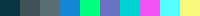
[`c0mfy`](colors/c0mfy.lua?raw=1) | 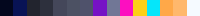
[`dracula`](colors/dracula.lua?raw=1) | 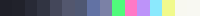
[`duorand`](colors/duorand.lua?raw=1) | 
[`duotone`](colors/duotone.lua?raw=1) | 
[`github-dark-dimmed`](colors/github-dark-dimmed.lua?raw=1) | 
[`gruvbox_dark`](colors/gruvbox_dark.lua?raw=1) | 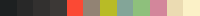
[`liqube`](colors/liqube.lua?raw=1) | 
[`mariana`](colors/mariana.lua?raw=1) | 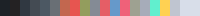
[`monodark`](colors/monodark.lua?raw=1) | 
[`monokai`](colors/monokai.lua?raw=1) | 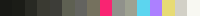
[`monokai-pro-classic`](colors/monokai-pro-classic.lua?raw=1) | 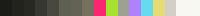
[`nord`](colors/nord.lua?raw=1) | 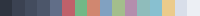
[`onedark`](colors/onedark.lua?raw=1) | 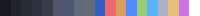
[`only_dark`](colors/only_dark.lua?raw=1) | 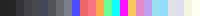
[`plasma`](colors/plasma.lua?raw=1) | 
[`vscode-dark`](colors/vscode-dark.lua?raw=1) | 
[`winter`](colors/winter.lua?raw=1) | 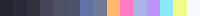
[`zenburn`](colors/zenburn.lua?raw=1) | 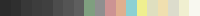

## Light

Theme | Preview
------|-----------------------------------------
[`github`](colors/github.lua?raw=1) | 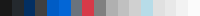
[`gruvbox_light`](colors/gruvbox_light.lua?raw=1) | 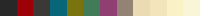
[`moe`](colors/moe.lua?raw=1) | 
[`solarized_light`](colors/solarized_light.lua?raw=1) | 
[`solarobj`](colors/solarobj.lua?raw=1) | 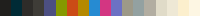

